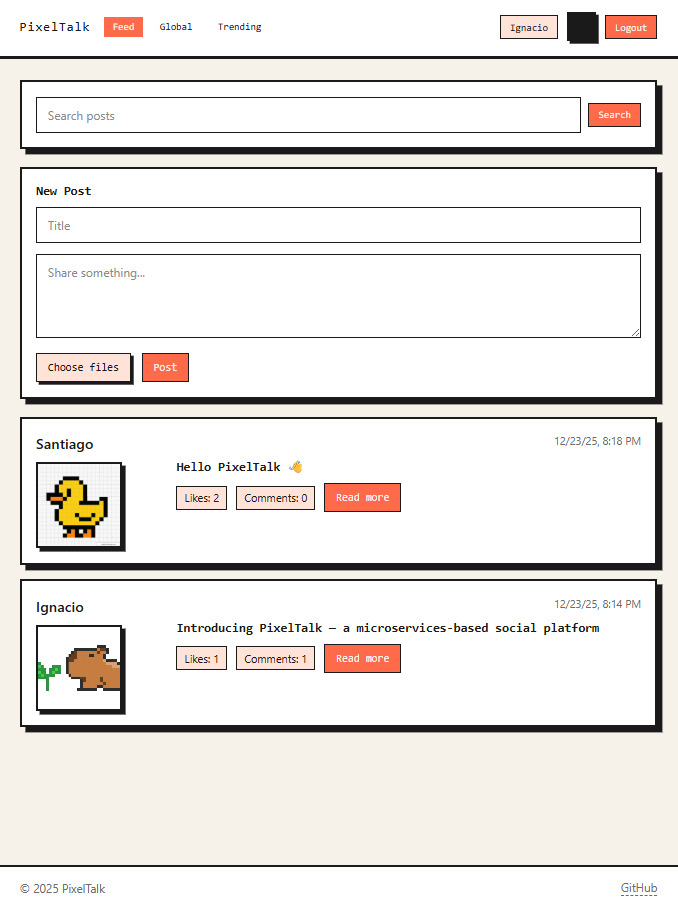
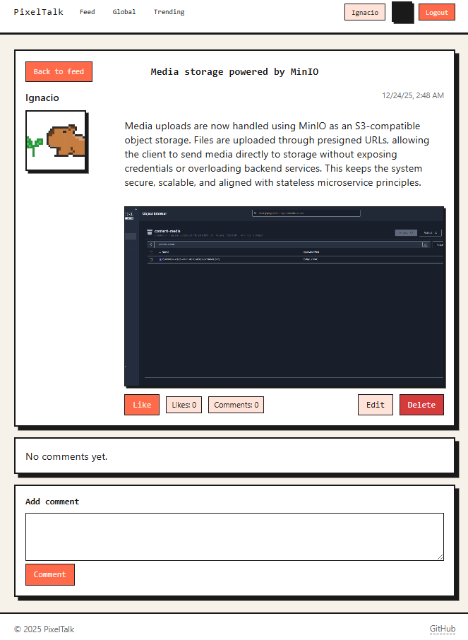
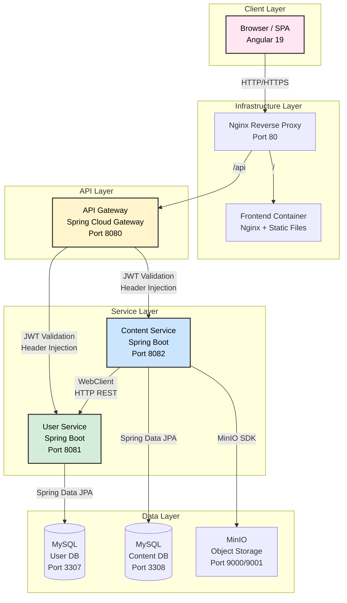

# PixelTalk - Community Platform

> Full-stack social platform with Spring Boot microservices,
> Angular 19 frontend, fully Dockerized.

[](https://www.oracle.com/java/)
[](https://spring.io/projects/spring-boot)
[](https://angular.io/)
[](https://www.docker.com/)

---

## 📖 Table of Contents

- [Overview](#-overview)
- [Screenshots](#-screenshots)
- [System Architecture](#-system-architecture)
- [Technology Stack](#-technology-stack)
- [Design Patterns & Best Practices](#-design-patterns--best-practices)
- [Microservices](#-microservices)
- [Frontend Architecture](#-frontend-architecture)
- [Security Implementation](#-security-implementation)
- [Features](#-features)
- [Testing](#-testing)
- [Getting Started](#-getting-started)
- [API Documentation](#-api-documentation)

---

## 🌟 Overview

**PixelTalk** is a full-stack social platform built with a **microservices architecture*. The project provides a solid foundation in distributed systems, API design, authentication/authorization, containerization, and reactive programming.

### Key Highlights

- **Microservices Architecture** with independent deployment and scaling
- **API Gateway Pattern** for centralized routing and JWT validation
- **Synchronous HTTP inter-service communication** using Spring WebClient
- **S3-compatible object storage** with MinIO for media management
- **Modern SPA** built with Angular 19 standalone components
- **Containerized deployment** with Docker multi-stage builds
- **RESTful API design** with comprehensive OpenAPI/Swagger documentation

---

## 📸 Screenshots

| Feed | Post Detail |
|---|---|
|  |  |

---

## 🏗️ System Architecture

### High-Level Architecture Diagram



### Architecture Patterns

- **Microservices Architecture**: Services are independently deployable, scalable, and maintainable
- **API Gateway Pattern**: Centralized entry point for all client requests
- **Database per Service**: Each microservice owns its database, ensuring loose coupling
- **Backend for Frontend (BFF)**: Clear separation between client and server concerns
- **HTTP-based inter-service communication**: HTTP-based inter-service communication with WebClient

### Request Flow

1. **Client Request** → Nginx Reverse Proxy (`/api` or `/`)
2. **Reverse Proxy** → Routes to Frontend (static files) or API Gateway
3. **API Gateway** → Validates JWT, extracts user identity, injects headers (`X-User-Id`, `X-Username`)
4. **Microservices** → Process business logic using injected identity headers
5. **Inter-Service Communication** → Content Service enriches responses with User Service data via synchronous HTTP calls (WebClient)
6. **Response** → JSON data flows back through the chain to client

---

## 🛠️ Technology Stack

### Backend - Java Ecosystem

| Technology | Version | Purpose |
|------------|---------|---------|
| **Java** | 17 (LTS) | Programming language |
| **Spring Boot** | 3.2.1 | Application framework |
| **Spring Cloud Gateway** | 2023.0.0 | API Gateway implementation |
| **Spring Data JPA** | - | Data persistence layer |
| **Spring Security** | - | Authentication & authorization |
| **Spring WebFlux** | - | Reactive HTTP client (WebClient) |
| **Hibernate** | - | ORM framework |
| **MySQL** | 8.0 | Relational database |
| **MinIO** | Latest | S3-compatible object storage |
| **MapStruct** | 1.5.5 | DTO-Entity mapping |
| **Lombok** | - | Boilerplate reduction |
| **JJWT** | 0.12.3 | JWT token generation/validation |
| **Springdoc OpenAPI** | 2.3.0 | API documentation (Swagger) |
| **Jackson** | - | JSON serialization/deserialization |
| **JUnit 5** | Jupiter | Testing framework |
| **Mockito** | - | Mocking framework |
| **AssertJ** | - | Fluent assertions |
| **JaCoCo** | 0.8.11 | Code coverage |
| **Maven** | 3.9 | Build automation & dependency management |

### Frontend - Modern JavaScript

| Technology | Version | Purpose |
|------------|---------|---------|
| **Angular** | 19 | SPA framework (standalone components) |
| **TypeScript** | 5.7.2 | Type-safe JavaScript |
| **RxJS** | 7.8 | Reactive programming |
| **SCSS** | - | CSS preprocessing |
| **Angular Router** | - | Client-side routing |
| **HttpClient** | - | HTTP communication |

### Infrastructure & DevOps

| Technology | Version | Purpose |
|------------|---------|---------|
| **Docker** | - | Containerization |
| **Docker Compose** | - | Multi-container orchestration |
| **Nginx** | Alpine | Reverse proxy & static file server |
| **Node.js** | 20 | Frontend build environment |
| **Maven** | 3.9-eclipse-temurin-17 | Java build environment |

---

## 📐 Design Patterns & Best Practices

### Architectural Patterns

#### **1. Microservices Architecture**
- **Independent services** with single responsibility
- **Isolated databases** (Database per Service pattern)
- **HTTP/REST** for synchronous communication
- **Decentralized data management**

#### **2. API Gateway Pattern**
- **Centralized routing** to backend services
- **Authentication/Authorization** at gateway level
- **Header injection** for user identity propagation
- **CORS management** for web clients

#### **3. Repository Pattern**
```java
// Spring Data JPA repositories provide abstraction over data access
public interface UserRepository extends JpaRepository<UserEntity, Long> {
    Optional<UserEntity> findByUsername(String username);
    Optional<UserEntity> findByEmail(String email);
}
```

#### **4. Data Transfer Object (DTO) Pattern**
- **Separation of concerns** between API models and domain entities
- **Validation** at DTO level with Bean Validation
- **Automatic mapping** with MapStruct
```java
@Mapper(componentModel = "spring")
public interface UserMapper {
    UserResponseDto toResponseDto(UserEntity entity);
    UserEntity toEntity(UserCreateDto createDto);
}
```

#### **5. Service Layer Pattern**
- **Business logic encapsulation** in service classes
- **Transaction management** with `@Transactional`
- **Dependency injection** via constructor injection

#### **6. Interceptor/Filter Pattern**
- **JWT validation filter** in API Gateway
- **Auth interceptor** in Angular frontend
- **Error interceptor** for centralized error handling

### Security Patterns

#### **JWT-Based Stateless Authentication**
```
1. User logs in → User Service issues Access + Refresh tokens
2. Client stores tokens → Sent in Authorization header
3. API Gateway validates JWT → Extracts userId and username
4. Gateway injects headers → X-User-Id, X-Username to downstream services
5. Microservices trust Gateway → Use injected headers for authorization
```

#### **Bearer Token Authentication**
- **Authorization header**: `Bearer <JWT>`
- **Token validation** at gateway level
- **Claim extraction**: `sub` (userId), `username`

### Development Best Practices


#### **API Design**
- **RESTful conventions** (GET, POST, PUT, DELETE)
- **Resource-oriented URLs** (`/api/v1/users/{id}`)
- **HTTP status codes** (200 OK, 201 Created, 404 Not Found, etc.)
- **Versioning** (`/api/v1`)
- **Pagination support** for list endpoints
- **ProblemDetail** (RFC 7807) for error responses

#### **Domain-Driven Design Elements**
- **Entities** represent domain objects (UserEntity, PostEntity)
- **Repositories** for data access abstraction
- **Services** for business logic
- **Value Objects** (DTOs for data transfer)

#### **Data Optimization**
- **Database indexes** on frequently queried columns (userId, createdAt)
- **Eager/Lazy loading** control with JPA
- **Denormalized counters** (likeCount, commentCount) for performance
- **Soft deletes** with `deletedAt` field
- **Audit fields** (createdAt, updatedAt) via BaseEntity

---

## 📦 Microservices

### 1. API Gateway

**Purpose**: Centralized entry point for all API requests, handling routing, authentication, and header injection.

**Key Responsibilities**:
- Route requests to appropriate microservices
- Validate JWT tokens
- Extract user identity from tokens
- Inject `X-User-Id` and `X-Username` headers
- CORS configuration for web clients


---

### 2. User Service

**Purpose**: Manages user authentication, authorization, profiles, and social relationships (follows).

**Key Features**:
- User registration with password hashing (BCrypt)
- Login with JWT token generation (access + refresh)
- Token refresh mechanism
- User profile management (CRUD)
- Follow/Unfollow system
- Follower/Following lists

**Technologies**:
- Spring Boot 3.2.1
- Spring Security + JJWT
- Spring Data JPA
- MySQL 8.0
- MapStruct for DTO mapping
- Lombok for boilerplate reduction

---

### 3. Content Service

**Purpose**: Manages user-generated content (posts, comments, likes) and media storage.

**Key Features**:
- Post creation, editing, deletion (soft delete)
- Comment system on posts
- Like/Unlike for posts and comments
- Media upload to MinIO (presigned URLs)
- Author enrichment via User Service

**Technologies**:
- Spring Boot 3.2.1
- Spring WebFlux (WebClient for inter-service calls)
- Spring Data JPA
- MySQL 8.0
- MinIO Java SDK for object storage
- MapStruct for DTO mapping


**Inter-Service Communication**:
- **Synchronous HTTP request-response** pattern
- **WebClient** (reactive HTTP client from Spring WebFlux) to call User Service REST APIs
- **Blocking calls** (`.block()`) for simplicity in current implementation
- Enriches post/comment responses with author username and fullName
- Timeout configuration (2000ms default) to prevent hanging
- Graceful degradation on User Service failure (returns partial data)

**Media Storage Flow**:
```
1. Client requests presigned upload URL
2. Content Service generates URL → MinIO
3. Client uploads directly to MinIO
4. Client confirms upload → Content Service
5. Content Service stores metadata in DB
6. For downloads: presigned download URLs
```

---

## 🎨 Frontend Architecture

### Angular 19 - Modern SPA

**Architecture Highlights**:
- **Standalone components** (no NgModules required)
- **Feature-based folder structure** for scalability
- **Reactive programming** with RxJS
- **Type-safe** with TypeScript
- **SCSS** for modern styling

### Key Patterns

#### **HTTP Interceptors**

**Auth Interceptor**: Automatically injects JWT token
```typescript
export const authInterceptor: HttpInterceptorFn = (req, next) => {
  const token = authService.getAccessToken();
  if (token && isApiRequest) {
    const authReq = req.clone({
      setHeaders: { Authorization: `Bearer ${token}` }
    });
    return next(authReq);
  }
  return next(req);
};
```

**Error Interceptor**: Centralized error handling
```typescript
export const errorInterceptor: HttpInterceptorFn = (req, next) => {
  return next(req).pipe(
    catchError((error: HttpErrorResponse) => {
      // Handle errors globally
      return throwError(() => error);
    })
  );
};
```

#### **Route Guards**

```typescript
export const authGuard: CanActivateFn = (route, state) => {
  const authService = inject(AuthService);
  if (!authService.isAuthenticated()) {
    router.navigate(['/login']);
    return false;
  }
  return true;
};
```

#### **Environment-Based Configuration**

```typescript
// Production: API calls go through reverse proxy
export const environment = {
  production: true,
  apiBaseUrl: '/api'  // Nginx routes to API Gateway
};

// Development: Direct API Gateway connection
export const environment = {
  production: false,
  apiBaseUrl: 'http://localhost:8080/api'
};
```

---

## ✨ Features

### User Management
- ✅ User registration with email/username validation
- ✅ Login with JWT-based authentication
- ✅ Token refresh mechanism
- ✅ User profile viewing and editing
- ✅ Password hashing with BCrypt

### Social Features
- ✅ Follow/Unfollow users
- ✅ View followers and following lists
- ✅ Check follow status between users

### Content Management
- ✅ Create, edit, delete posts (soft delete)
- ✅ Post listing with pagination
- ✅ Search posts by content/title
- ✅ Trending posts algorithm
- ✅ Comment on posts
- ✅ Edit/delete comments
- ✅ Like/Unlike posts and comments
- ✅ View like counts

### Media Management
- ✅ Upload images/files to MinIO
- ✅ Presigned URL flow (secure, direct uploads)
- ✅ Presigned download URLs
- ✅ Media metadata storage

### Technical Features
- ✅ Author enrichment (posts/comments include author details)
- ✅ Inter-service communication with WebClient
- ✅ Graceful degradation on service failures
- ✅ Database indexing for performance
- ✅ Soft deletes for data retention
- ✅ Audit fields (createdAt, updatedAt, deletedAt)

---

## 🧪 Testing

### Testing Stack

| Technology | Version | Purpose |
|------------|---------|---------|
| **JUnit 5** | Jupiter | Testing framework |
| **Mockito** | - | Mocking framework |
| **MockMvc** | Spring Test | Controller testing |
| **AssertJ** | - | Fluent assertions |
| **JaCoCo** | 0.8.11 | Code coverage analysis |

### Testing Patterns

#### **Service Layer Testing (Unit Tests)**

Tests use **Mockito** for mocking dependencies and **AssertJ** for assertions:

```java
@ExtendWith(MockitoExtension.class)
class UserServiceImplTest {

    @Mock
    private UserRepository userRepository;

    @Mock
    private UserMapper userMapper;

    @Mock
    private PasswordEncoder passwordEncoder;

    @InjectMocks
    private UserServiceImpl userService;

    @Test
    void createUserReturnsResponse() {
        // Given
        UserCreateDto request = UserCreateDto.builder()
                .username("user1")
                .email("user1@example.com")
                .password("Password1!")
                .build();
        
        when(userRepository.existsByUsername("user1")).thenReturn(false);
        when(passwordEncoder.encode("Password1!")).thenReturn("hashed");
        when(userRepository.save(any())).thenReturn(savedEntity);

        // When
        UserResponseDto result = userService.createUser(request);

        // Then
        assertThat(result.getId()).isEqualTo(1L);
        verify(userRepository).save(any(UserEntity.class));
    }
}
```

**Key Patterns**:
- **Isolated testing**: Dependencies mocked to test single responsibility
- **Given-When-Then** structure for clarity
- **Mockito verification**: Ensures method calls with correct arguments
- **Edge case testing**: Validation errors, duplicate prevention, soft deletes
- **Exception testing**: Uses `assertThatThrownBy` for error scenarios

#### **Controller Layer Testing (Integration Tests)**

Tests use **MockMvc** for HTTP layer testing without starting the server:

```java
@WebMvcTest(AuthController.class)
@AutoConfigureMockMvc(addFilters = false)
class AuthControllerTest {

    @Autowired
    private MockMvc mockMvc;

    @MockBean
    private AuthService authService;

    @Test
    void registerReturnsCreated() throws Exception {
        // Given
        when(authService.register(any())).thenReturn(authResponse);

        // When & Then
        mockMvc.perform(post("/api/v1/auth/register")
                .contentType(MediaType.APPLICATION_JSON)
                .content(objectMapper.writeValueAsString(request)))
            .andExpect(status().isCreated())
            .andExpect(jsonPath("$.accessToken").value("access"));
    }
}
```

**Key Patterns**:
- **Slice testing**: Only loads MVC layer with `@WebMvcTest`
- **HTTP testing**: Validates request/response, status codes, JSON structure
- **Serialization testing**: Ensures DTO to/from JSON works correctly
- **Security bypass**: `addFilters = false` for focused controller logic testing

### Code Coverage with JaCoCo

#### **Configuration**

All microservices are configured with **JaCoCo Maven Plugin** for code coverage:

```xml
<plugin>
    <groupId>org.jacoco</groupId>
    <artifactId>jacoco-maven-plugin</artifactId>
    <version>0.8.11</version>
    <executions>
        <execution>
            <id>prepare-agent</id>
            <goals><goal>prepare-agent</goal></goals>
        </execution>
        <execution>
            <id>report</id>
            <phase>test</phase>
            <goals><goal>report</goal></goals>
        </execution>
        <execution>
            <id>check</id>
            <phase>verify</phase>
            <goals><goal>check</goal></goals>
        </execution>
    </executions>
</plugin>
```

#### **Lombok Integration**

Maven compiler is configured with Lombok annotation processing to ensure compatibility:

```xml
<annotationProcessorPaths>
    <path>
        <groupId>org.projectlombok</groupId>
        <artifactId>lombok</artifactId>
        <version>${lombok.version}</version>
    </path>
    <path>
        <groupId>org.mapstruct</groupId>
        <artifactId>mapstruct-processor</artifactId>
        <version>${mapstruct.version}</version>
    </path>
    <path>
        <groupId>org.projectlombok</groupId>
        <artifactId>lombok-mapstruct-binding</artifactId>
        <version>0.2.0</version>
    </path>
</annotationProcessorPaths>
```

This ensures Lombok generates code **before** MapStruct, preventing compilation errors.

### Running Tests

#### **View Coverage Report**
After running `mvn verify`, coverage reports are generated:
```
target/site/jacoco/index.html  # Open in browser
```

#### **Coverage Metrics**
- **Line coverage**: Percentage of code lines executed
- **Branch coverage**: Percentage of conditional branches tested
- **Method coverage**: Percentage of methods invoked

---

## 🚀 Getting Started

### Prerequisites

- **Docker** and **Docker Compose** installed
- **Ports available**: 80, 8080, 8081, 8082, 3307, 3308, 9000, 9001

### Quick Start

1. **Clone the repository**
   ```bash
   git clone <repository-url>
   cd pixel-talk
   ```

2. **Launch all services**
   ```bash
   docker compose -f infraestructure/docker-compose.yml up -d --build
   ```

3. **Wait for services to be ready** (MySQL health checks)
   ```bash
   docker compose -f infraestructure/docker-compose.yml logs -f
   ```

4. **Access the application**
   - **Frontend**: http://localhost
   - **API Gateway**: http://localhost:8080
   - **User Service**: http://localhost:8081
   - **Content Service**: http://localhost:8082
   - **MinIO Console**: http://localhost:9001

### Service Ports

| Service | Port | Description |
|---------|------|-------------|
| Reverse Proxy | 80 | Main entry point (frontend + API) |
| API Gateway | 8080 | API Gateway |
| User Service | 8081 | User microservice |
| Content Service | 8082 | Content microservice |
| User MySQL | 3307 | User database |
| Content MySQL | 3308 | Content database |
| MinIO API | 9000 | Object storage API |
| MinIO Console | 9001 | MinIO admin UI |

### Docker Architecture

```
Networks:
├── user-net         # User Service + User MySQL
├── content-net      # Content Service + Content MySQL + MinIO
└── backend-net      # All services + Gateway + Frontend + Reverse Proxy

Volumes:
├── user-mysql-data      # Persisted user database
├── content-mysql-data   # Persisted content database
└── minio-data           # Persisted object storage
```

### Environment Variables

Key environment variables (configured in `docker-compose.yml`):

```yaml
# User Service
USER_DB_URL: jdbc:mysql://user-mysql:3306/user_service_db
JWT_SECRET: dev-secret-key-change-in-production-min-256-bits

# Content Service
CONTENT_DB_URL: jdbc:mysql://content-mysql:3306/content_service_db
USER_SERVICE_URL: http://user-service:8081
MINIO_URL: http://minio:9000
MINIO_PUBLIC_URL: http://localhost:9000

# API Gateway
USER_SERVICE_URL: http://user-service:8081
CONTENT_SERVICE_URL: http://content-service:8082
JWT_SECRET: dev-secret-key-change-in-production-min-256-bits
```

---

## 📚 API Documentation

### Swagger UI

Each microservice exposes OpenAPI/Swagger documentation:

- **User Service**: http://localhost:8081/swagger-ui.html
- **Content Service**: http://localhost:8082/swagger-ui.html


---


## 👤 Author

**Ignacio Marucco**
- GitHub: [@ignaciomarucco](https://github.com/IgnacioMarucco)
- LinkedIn: [IgnacioMarucco](https://www.linkedin.com/in/ignacio-marucco/)

---
